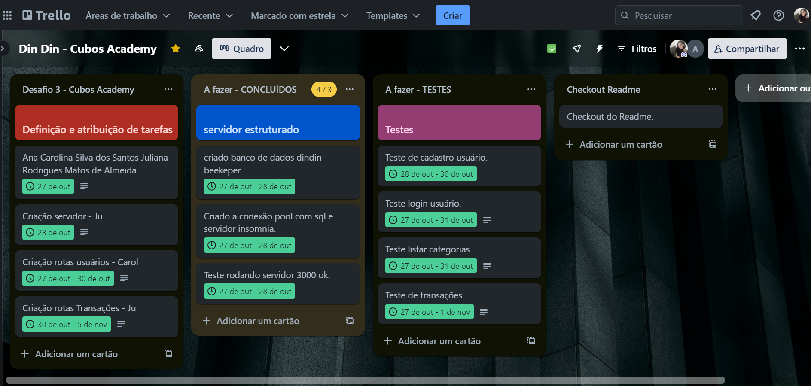
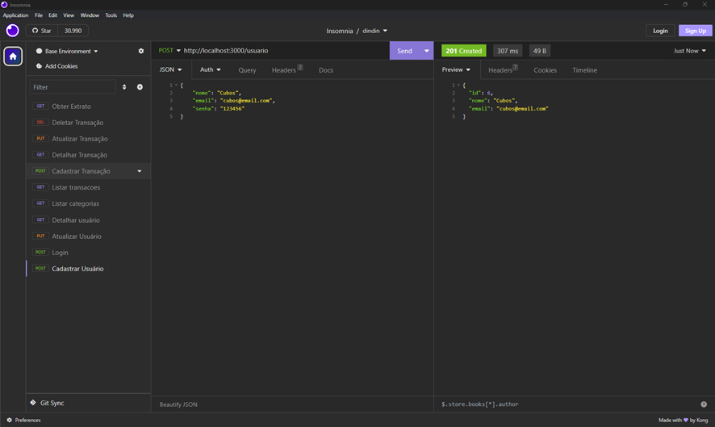
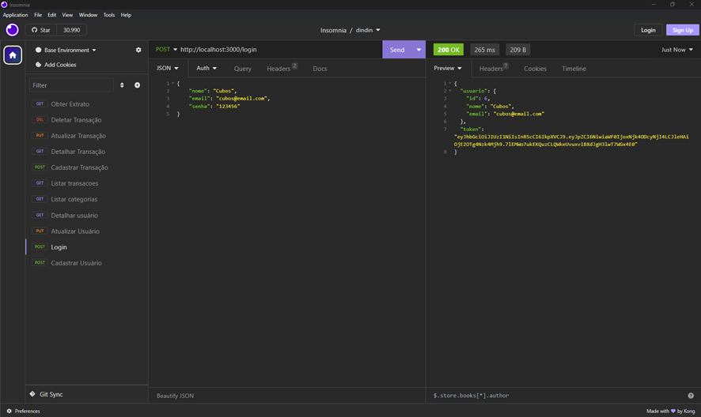
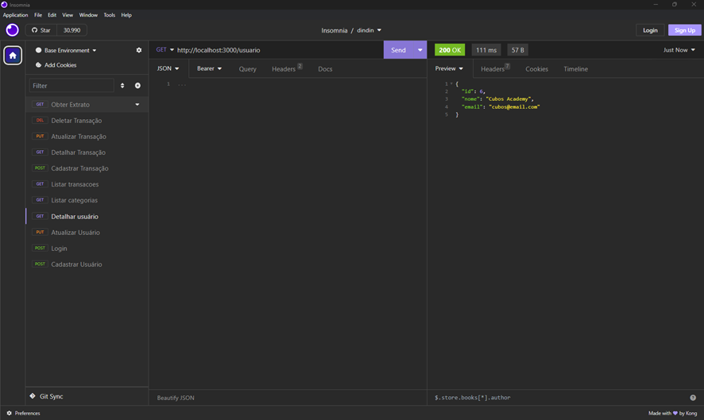
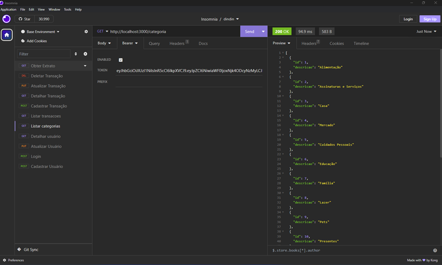
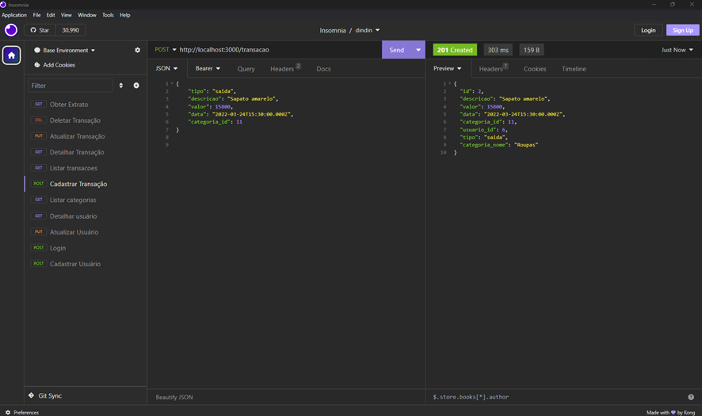
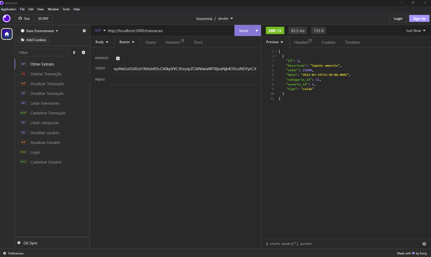

API-Controle-de-Financas
API - Controle de Finanças

Este repositório se refere a uma API de controle de finanças proposto como desafio Backend desenvolvida pela @cubosAcademy em parceria com @ifood e @potenciatech.

## Descrição do desafio

Seu papel é construir uma RESTful API que permita:

- Cadastrar Usuário
- Fazer Login
- Detalhar Perfil do Usuário Logado
- Editar Perfil do Usuário Logado
- Listar categorias
- Listar transações
- Detalhar transação
- Cadastrar transação
- Editar transação
- Remover transação
- Obter extrato de transações
- [Extra] Filtrar transações por categoria

# Desafio de Projeto Desenvolvido por :

Autoras :[Acarollina](https://github.com/Acarollina) e [Julirmatos](https://github.com/Julirmatos)

[Cubos Academy](https://cubosacademy.com.br/)

@ifood  @B2B @2023

# Testes do Projeto :

## Cadastrar Usuário

## Login

## Detalhar Perfil do Usuário Logado

## Listar Categorias

## Cadastrar Transação

## Obter Extrato

### Tecnologias e Ferramentas Utilizadas

